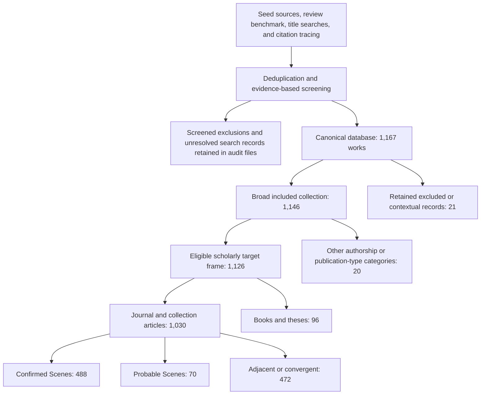

# Scenes in China: Data collection and measurement

**Methodological appendix to the introduction — updated draft, 8 September 2026.**

This appendix describes the publication corpus and bibliometric measures used in the introduction to *Scenes in China*. 

## 1. Purpose and scope

The collection was designed to trace the development of Chinese Scenes scholarship: its publication growth, topical and disciplinary diversification, citation connections, collaboration patterns, and relation to the contributions assembled in this volume. 

Identifying this literature required a multi-pronged search. 场景, 情景, and 情境 can refer to cultural scenes, media situations, social settings, technical scenarios, or ordinary contexts. The collection therefore distinguished substantive participation in Scenes theory from neighboring uses of scene and situation concepts. It also preserved relevant neighboring literature so that connections between traditions could be studied.

The broad collection includes original theoretical sources, translations, Chinese applications, related traditions, and selected contextual records. The resulting database spans publication years 1994–2026, with the confirmed works on Scenes Theory beginning in 2011. Most figures end in 2025 because 2026 was incomplete when collection closed. The result is an **observed corpus assembled through documented searches**, not a census of all Chinese Scenes scholarship or all Chinese uses of scene terminology.

## 2. Starting sources and search strategy

Discovery combined a curated seed registry, a published review benchmark, database searches, and citation tracing. The registry contains 18 theoretical, translation, gateway, review, and application sources. It includes the original *Scenescapes* and its Chinese translation, early Chinese introductions, and later empirical and policy applications. The purpose of these sources was to supply identifiable starting works and vocabulary, rather than to set an exclusive list of admissible authors.

Three early Chinese articles seeded a search through a chain of citations on Baidu Scholar: the 2013 introduction to Scenes Theory by Wu, Xia, and Clark; Wu's 2014 review article; and Wu and Clark's 2014 public-policy article. The chain searches exposed 49 unique Baidu paper identifiers before substantive screening. Bibliographic details of these starting works appear in [the references below](#references-for-the-starting-sources).

The 2026 review by Hu and colleagues provided a separate benchmark. Its 82 bibliography entries and 13 works named in its representative or highly cited tables were crosswalked against the developing corpus. Hu et al's review reports analyzing 289 CNKI and Web of Science records, but the underlying 289-title dataset was unavailable during collection. Consequently, the project reconstructed the literature independently and did not claim to reproduce that unavailable dataset. See the [review's journal record](https://www.rddl.com.cn/CN/10.13284/j.cnki.rddl.20250547).

### Sources and their roles

| Source | Use in this project | Search or observation procedure | Relevant coverage limit |
| --- | --- | --- | --- |
| Curated seed registry and supplied chapter references | Starting works, terminology, bibliographic leads | Trace named works, title variants, translations, and cited or citing publications | Starting points can favor established authors and recognized gateways |
| Published 2026 review | Independent discovery and coverage benchmark | Crosswalk the published bibliography and table-named works | Its underlying 289-record dataset was not available |
| National Center for Philosophy and Social Sciences Documentation (NCPSSD) | Main systematic expansion of the publication corpus | Public title-field searches; retain supplied titles, authors, years, venues, keywords, and abstracts where available | Title searches can miss applications whose titles use other terminology |
| Baidu Scholar | Initial citation-chain discovery and selected identity/count checks | Exact or normalized title searches and exposed cited-by results | Displayed counts and accessible result lists need not agree |
| Wanfang | Bibliographic matching, citation-count snapshots, and citing-publication lists | Exact-record searches and public record/relation pages | No-match and access failures are distinct from observed zero citations |
| Google Scholar | Selected identity checks, count snapshots, and supplemental cited-by lists | Exact-title and cited-by searches when accessible | Access varied; early CAPTCHA blocks and later successful observations are recorded separately |
| Official journal/publisher pages, repositories, and public reference lists | Identity repair, abstracts/full text where accessible, source verification, and field evidence | Bounded searches for particular titles, identifiers, authors, or venues | Evidence depth varies by record |
| Crossref and OpenAlex | Selected identifier and open-index checks, including chapter-source supplements | DOI/title matching and source-specific observations | Their coverage and citation counts are not interchangeable with Chinese databases |

The principal discovery records are dated 30 August–1 September 2026. Later supplements include citation snapshots dated 2 September, a reference-profile supplement dated 3 September, and a targeted citation/metadata refresh on 8 September. The refresh completed previously outstanding public citation-list captures and refreshed DOI-index metadata for chapter sources; it did not repeat the entire search or refresh every database count. CNKI-hosted public journal pages or metadata could supply particular records; the project did not conduct an independent subscription-database export of the review's CNKI/Web of Science sample.

### Search terms and expansion

An early broad NCPSSD pass searched five terms separately: `场景理论`, `文化场景`, `消费场景`, `文化舒适物`, and `场景视角`. The searches returned 317, 82, 105, 4, and 43 observations, respectively: 551 observations representing 533 unique records within that pass. Screening separated strong theoretical signals, possible applications, and generic or alternative uses; the priority categories organized the work and did not by themselves determine inclusion.

Seventeen subsequent discovery rounds expanded from explicit theory names to applications, conceptual variants, neighboring traditions, English formulations, and dimensions of Scenes theory. The saved searches use NCPSSD title fields. For example, the expression for a term `TERM` in the later rounds was:

```text
(IKTE="TERM" OR IKPYTE="TERM" OR IKET="TERM")
```

These were separate term searches, not one Boolean query requiring all expressions to appear together. Query logs preserve expressions, returned totals, pages inspected, and access or truncation states. The round ledger records 3,239 screening events across the seventeen rounds. This is not a globally deduplicated count of all candidates: records can recur across routes, and earlier exclusions were sometimes reconsidered as the boundary was clarified.

<details>
<summary>Exact title-search terms by discovery round</summary>

| Round | Exact terms (searched separately) |
| --- | --- |
| 1 | `场景营造`; `场景测度`; `场景价值`; `场景维度`; `城市气质`; `蜂鸣生产力` |
| 2 | `场景建构`; `场景构建`; `场景营城`; `场景红利`; `场景生产`; `场景感知`; `地方品质`; `生活文化设施`; `场景设计` |
| 3 | `场景更新`; `场景化改造`; `场景再造`; `场景塑造`; `场景营建`; `场景生成`; `场景认同`; `场景体验`; `文化消费新场景`; `文旅场景` |
| 4 | `场景创新`; `场景治理`; `场景生态`; `场景驱动`; `场景赋能`; `场景融合`; `场景培育`; `场景活力`; `场景机制`; `场景转型` |
| 5 | `场景理论`; `文化场景理论`; `新芝加哥学派`; `场景主义`; `城市场景`; `文化场景`; `场景研究`; `场景分析`; `场景评价`; `场景指数` |
| 6 | `文化舒适物`; `城市舒适物`; `文化便利设施`; `城市便利设施`; `场景指标`; `场景量表`; `场景测量`; `场景测评`; `场景评分`; `场景得分` |
| 7 | `消费场景`; `生活场景`; `社交场景`; `休闲场景`; `夜间场景`; `家庭场景`; `阅读场景`; `演艺场景`; `公共生活场景`; `地方消费主义` |
| 8 | `场景社会学`; `场景美学`; `场景文化`; `场景空间`; `场景叙事`; `场景传播`; `场景消费`; `场景公共性`; `场景生活`; `都市文化场景` |
| 9 | `场景化传播`; `情境传播`; `语境传播`; `在场传播`; `场景媒介`; `全场景社会`; `全场景消费`; `情境消费`; `生活情境`; `情境伦理` |
| 10 | `数字场景化传播`; `媒介场景`; `媒介情境`; `情境完整性`; `场景完整性`; `社交情境消费`; `情境空间`; `日常情境`; `场景任务`; `情境主义` |
| 11 | `Scene Theory`; `Theory of Scenes`; `Cultural Scenes`; `Urban Scenes`; `Scenescapes`; `Scene Sociology`; `Scene Dimensions`; `Scene Index`; `Scene Measurement`; `Scene Quality` |
| 12 | `Scene-Based`; `Scene Perspective`; `Scene Analysis`; `Scene Construction`; `Scene Making`; `Scene Planning`; `Scene Building`; `Scene Consumption`; `Scene Governance`; `Scene Experience` |
| 13 | `情境构建`; `情景构建`; `情境体验`; `情景体验`; `场景式消费`; `场景式阅读`; `场景化治理`; `未来社区场景`; `元社区场景`; `公共文明情境` |
| 14 | `场景视角`; `场景视域`; `场景框架`; `场景范式`; `场景逻辑`; `场景思维`; `场景方法`; `场景概念`; `场景模型`; `场景理论应用` |
| 15 | `场景真实性`; `场景戏剧性`; `场景合法性`; `真实性戏剧性合法性`; `场景特征`; `场景要素`; `场景类型`; `场景品质`; `场景属性`; `场景变量` |
| 16 | `芝加哥场景`; `克拉克场景理论`; `西尔弗场景理论`; `十五维场景`; `三维场景理论`; `真实性戏剧性合理性`; `场景舒适物`; `场景文化价值`; `场景生活方式`; `场景地方性` |
| 17 | `场景规范性`; `场景仪式性`; `场景越轨性`; `场景乡土性`; `场景自我表达`; `场景族群性`; `场景时尚性`; `场景功能性`; `场景安全性`; `场景成本性` |

</details>

### Stopping discovery

The practical stopping rule required two consecutive rounds with no more than four constitutive additions, fewer than eight total additions, no new conceptual or genealogical stream, and no unresolved candidate capable of overturning those numerical thresholds. “Constitutive” refers to screening judgments that scene concepts centrally organize a work's explanation or analytical apparatus, as distinct from an application or interpretive overlay. This was a working rule refined during collection, not a preregistered protocol established before the first search.

Rounds 16 and 17 met the rule. Round 16 returned three records and added three constitutive works; round 17 returned one record, excluded it, and added none. Neither identified a new stream. 

## 3. Assembly, screening, and membership

### Identifying distinct works

The main collection build normalized title strings, first-author strings, and publication years to identify repeated works. Source observations were attached to stable work identifiers. Database identifiers and DOI or ISBN evidence supported matching and verification; explicit overrides handled known duplicate or conflicting records. These operations preserved the distinction between a source's observed metadata and a corrected canonical record.

For citing publications, the integration scripts used available database identifiers, DOI matches, and normalized title/year combinations. Analytical citation tables deduplicated each citing-work/target-work pair before counting it, so finding the same relation through multiple sources did not create extra citations. Residual matching errors remain possible, especially for records lacking authors, years, or stable identifiers.

### Substantive screening

Screening used the available title, keywords, abstract, bibliographic context, and, where accessible, reference lists or full text. Universal full-text review was not required. Decisions recorded the available evidence, inclusion or exclusion reason, and uncertainty. Screening and subsequent checks were assisted by Codex, as explained in Section 7.

The broad boundary sought works in which scene concepts organize a meaningful cultural, spatial, or situated configuration or mechanism. Relevant evidence included combinations of facilities or amenities, people, practices, meanings or values, and an explanation of experience, identity, development, governance, or spatial change. A direct citation to Clark, Silver, or an English original was not mandatory: Chinese-mediated developments could qualify. Conversely, absence of foreign citations in an abstract was not evidence of intellectual independence.

Generic technical scenarios, optimization problems, ordinary literary scene description, and teaching or marketing situations without substantive continuity were excluded from the focal tradition. Relevant alternative traditions were retained as adjacent or genealogical evidence when the available material supported that role. Admission to the broad collection therefore did not establish confirmed membership in Scenes theory scholarship.

### Derived membership tiers

A subsequent rule-based classification distinguishes the strength of evidence for participation in Scenes theory scholarship. It combines titles, stored substantive markers, inclusion rationales, and coded lineage/reference evidence. 

| Tier | Operational meaning | Use in the introduction |
| --- | --- | --- |
| Confirmed Scenes | Positive recorded evidence of explicit theory language, documented lineage or reference connections, a distinctive Scenes apparatus, or a documented textual connection | Main Scenes sample |
| Probable Scenes | Focal vocabulary and substantive architecture, with insufficient evidence for a confirmed connection | Available as an extended sensitivity sample; excluded from the main displayed Scenes totals |
| Adjacent/convergent | A related scene/situation tradition or substantive resemblance without the recorded evidence needed for confirmed or probable membership | Separate comparison population |
| Unresolved | Evidence insufficient for assignment | Available category; no included canonical work currently has this derived tier |
| Outside broad corpus | A retained canonical record with an exclusion decision | Audit/context only |


## 4. Sample sizes and analytical populations

The final canonical database is not the complete search-result universe. Many screened exclusions remain in discovery and screening files rather than becoming canonical works. 

| Retained population | All works | Confirmed Scenes | Probable Scenes | Adjacent/convergent | Outside broad corpus |
| --- | ---: | ---: | ---: | ---: | ---: |
| Canonical work database | 1,167 | 601 | 70 | 475 | 21 |
| Broad included collection | 1,146 | 601 | 70 | 475 | 0 |
| Chinese-authored/Chinese-led scholarly target frame | 1,126 | 584 | 70 | 472 | 0 |
| Primary journal and collection-article population | 1,030 | 488 | 70 | 472 | 0 |

The scholarly target frame includes journal articles, collection articles, books, and theses. It excludes translated/wholly foreign sources and noneligible publication types retained in the broad collection. Restricting this frame to journal and collection articles removes 96 books or theses. The main primary-publication sample comprises 488 confirmed works; the corresponding confirmed-plus-probable sensitivity sample comprises 558. 




Within the 488 confirmed primary publications, 46 are dated 2026. Removing them leaves 442 publications for the 2011–2025 annual series. The period-composition figures additionally omit the single 2011 publication, leaving 441 across 2012–2016, 2017–2019, 2020–2022, and 2023–2025: respectively 15, 39, 128, and 259 works. 

## 5. Bibliometric metadata and coverage

### Identity and provenance

Bibliographic fields include titles, authors, publication year, venue, publication type, DOI/ISBN where available, source identifiers, and evidence links. A work was counted as supported by multiple sources when at least two distinct source families supplied accepted evidence. Multiple pages from one database did not automatically constitute independent corroboration. At the time of publication, 501 of the 1,030 primary works had accepted evidence from at least two source families. 

### Citation-count snapshots

Displayed citation counts were recorded by target, database, and observation date. Counts from different databases were kept separate because they cover different indexed publications. An exact record displaying zero supplied an observed zero; no-match and access-unavailable outcomes remained missing.

Wanfang searches covered all 1,126 scholarly targets: 1,055 had an accepted count, 70 had no exact-title match, and one had an access-unavailable outcome. Among the 584 confirmed scholarly targets, the corresponding figures were 558, 25, and one. 

| Database | Publications with a citation count |
| --- | ---: |
| Wanfang | 1,055 |
| Google Scholar | 29 |
| Baidu Scholar | 1 |
| OpenAlex | 2 |
| Crossref | 2 |


### Observed citing publications

Citation networks use harvested citing-publication records. The analytical sample contain 8,186 distinct citing publications and 14,401 relation observations with database/date provenance. Collapsing repeated observations yields 14,295 distinct citing-work/target-work pairs. 

Database identifiers, DOI matches, normalized titles and years, and reviewed bilingual matches link citing records to distinct works. Raw metadata and identity crosswalks preserve source-specific alternatives and duplicate aliases. Abbreviated or conflicting snippets did not automatically replace fuller existing metadata. New field assignments based on titles and venues were marked provisional (T3).

A Crossref supplement supplies counts without the corresponding citing lists. OpenAlex citing lists remain attributed to OpenAlex. Chapter-source lists contribute to the main network only when the cited chapter source matches a target in the scholarly frame; other lists remain supplemental. Publication year is available for 8,005 citing records; the remaining 181 are omitted from temporal calculations.

## 6. Measures used in the introduction

### Topics and title markers

Each scholarly target receives one primary topic from a deterministic title-rule classifier. The classifier evaluates ordered Chinese term dictionaries, retains up to three secondary matches, and assigns the first matching family unless a specified title override applies. Nine titles have overrides in the coding script. Titles without a match or override receive the residual interdisciplinary/other category. Chinese titles are preferred where available; selected English titles have explicit overrides. This procedure is not a statistical topic model.

The primary categories, in rule precedence order, are residential/housing; sport/leisure; rural development; digital/virtual/media; tourism/heritage/place; public culture/community; creative industries/innovation; cultural consumption/commercial activity; urban renewal/design; arts/identity/education; theory gateways/reviews; and policy/governance/measurement. Interdisciplinary/other is the thirteenth, residual category. A work matching several subjects contributes to one primary category in Figure 2. The dictionary order therefore affects the observed composition.

Three separate binary variables identify titles containing design, policy, or measurement expressions. Design markers include terms such as 设计, 营造, 更新, and 规划; policy markers include 政策, 治理, 战略, and 乡村振兴; measurement markers include 评价, 指标, 测量, 实证, and 数据. The lists are broader than these examples and are preserved in the coding script. The flags overlap, so their shares need not sum to 100 percent. They measure what a title signals, not verified use of a particular method or evidence that a policy intervention occurred.

Topic and marker results should be interpreted as exploratory measurements of titles, with sensitivity to terminology, language, rule order, and overrides.

### Disciplinary fields

For publishing fields, each confirmed primary work inherits a harmonized field from its journal or collection venue, with documented repairs for ambiguous venue identities, editions, and gaps in the classification vocabulary. The final work-level audit assigns fields to all 488 confirmed primary publications. These fields describe publishing venues, not the academic training of individual authors.

For citing fields, evidence includes supplied disciplinary labels, venue mappings, article-level information, and provisional title/venue rules. Some assignments inherit the most common existing field for an exact normalized venue; others use title/venue dictionaries or a residual category. The introduction's citing-field distribution counts 4,509 distinct publications citing at least one confirmed scholarly target, counting a source once even when it cites several targets. Of these, 1,682 carry higher-confidence assignments and 2,827 carry provisional assignments. The latter are included in the displayed distribution. A higher-confidence-only sensitivity table is available.

### Citation and collaboration measures

A co-citation tie joins two target works cited by the same later publication. Its weight is the number of distinct shared citing publications. It is not a direct citation between the two targets. Figure 1 displays a selected central portion of this network: the upstream procedure keeps pairs sharing at least two citing sources, selects the 48 strongest confirmed/probable nodes, and retains the union of the 85 strongest links among those nodes and each node's two strongest incident links. The introduction then removes the two probable nodes and their incident links, leaving 46 confirmed nodes and 128 links. Node sizes encode Wanfang counts and colors encode six broad topic groups. The displayed prominence is conditional on the collected network and this selection procedure. The refreshed display retains 46 nodes and 128 links; one selected paper changes after the newly captured citing lists are incorporated.

The citation histories in Figure 4 count distinct observed citing publications by their publication year, accumulate those counts, and align selected targets by years since publication. The build fills intervening years with zero observed new sources and displays years through 2025. 

A bridge publication in Figure 5 cites at least one confirmed Scenes target and at least one adjacent/convergent target in the scholarly frame. Its yearly percentage is the number of such publications divided by all observed citing publications in that year that cite at least two distinct targets in the frame, including probable targets in the denominator. The publication comparison uses trailing three-year means, `(n[t] + n[t−1] + n[t−2]) / 3`, calculated from the annual primary-publication series.

For coauthorship, author strings were split and normalized for punctuation and whitespace, and repeated author/work combinations were removed. Each distinct author pair sharing a confirmed scholarly work supplies one undirected tie; its weight is their number of shared works. A collaboration group is a connected component, meaning authors can be joined through intermediate coauthors. Figure 7 uses all collaborative components: 656 distinct pairs in 260 components, with 16 pairs recurring on more than one work. Single-author isolates are excluded. 

### Figure populations and construction

| Introduction figure | Population and time window | Calculation or mapping |
| --- | --- | --- |
| 1. Gateway centrality | Selected 46-node confirmed co-citation network | Shared-citing-source ties; Wanfang node size; broad topic colors; selection rule described above |
| 2. Topic diversification | 441 confirmed primary publications, grouped into four periods spanning 2012–2025 | Primary-topic counts divided by each period's publication total; zero combinations retained |
| 3. Disciplinary spread | A: all 488 confirmed primary publications, including 2026; B: 4,509 distinct observed sources citing confirmed scholarly targets | A: publishing-venue field; B: citing-source field, including provisional assignments |
| 4. Publication takeoff and citation timing | A: 442 confirmed primary publications, 2011–2025; B: six selected confirmed targets, citing years through 2025 | Annual counts; cumulative observed citing-publication counts aligned by target age |
| 5. Neighboring literatures and bridges | A: confirmed and adjacent primary publications, displayed 2010–2025; B: citing-publication years 2020–2024 | Trailing three-year publication averages; bridge counts and shares among multi-target citing publications |
| 6. Operational turn | Same 441 publications and four periods as Figure 2 | Share with each title marker; design, policy, and measurement may overlap |
| 7. Coauthorship structure | Collaborative authors in the 584 confirmed scholarly targets, including books/theses and 2026 where present | Undirected author-pair network and connected-component size distribution |
| 8. Position of the volume | All 17 focal chapters, Chapters 2–18 | Chapter-source publication year and assigned thematic branch; every chapter displayed once |

The chapter-source crosswalk is separate from the field's publication denominator. Eleven chapter sources match targets in the frozen corpus; six are identified through other source records or published-counterpart checks. Chapter 1 supplies volume framing and is excluded from this comparison. Chapter branches are assigned in the chapter crosswalk and need not reproduce a title-rule classification of the chapter text. For Chapter 14, Figure 8 uses the online publication year, 2022, while the canonical corpus uses the issue year, 2023. Crossref metadata confirms online publication on 21 December 2022; both dates are retained.

## 7. Use of Codex and quality checks

OpenAI's Codex was used in assembling and documenting this research, including drafting this appendix. Its work included search and retrieval assistance, preparation of screening records and evidence summaries, implementation of matching and classification rules, construction of analysis code and figures, and checks of the resulting files. The author supplied the volume materials and directed substantive boundary decisions and revisions. This appendix's final interpretation and wording were subject to author review.

Two models were used for this work: `gpt-5.6-sol` (26 August–5 September 2026), and `gpt-6-astra`. 

Some collection rounds used multiple Codex workers for separate screens, cross-checks, or disagreement review. Other rounds used deterministic triage and coordinator review. Model disagreement checks can expose errors, but shared model assumptions may remain. 

The pipeline checks unique identifiers, allowed classification values, joins, consistency between membership tiers and analytical flags, citation-count formats, duplicate relations, orphan links, and count/list reconciliation for lists marked complete. The citation audit reports zero duplicate citing-work/target-work/database/date observations, orphan edges, noninteger counts, nonmatch outcomes incorrectly encoded as zero, or mismatches among lists marked complete. Its separate queue records the one quarantined Scholar identity; the two Crossref count-only records are documented separately.


## 8. Limitations and reproducibility

The principal limitation is uneven observability. Starting sources shape citation tracing; title searches privilege explicit vocabulary; databases cover different publications; public records differ in completeness; and some identities remain supported by only one source family or carry unresolved holds. These features can affect observed publication growth as well as apparent topical, disciplinary, and network patterns. Low-yield search rounds do not eliminate those biases.

Measurement adds further uncertainty. Membership tiers inherit the strengths and weaknesses of the underlying evidence and coding rules. Topic and operational-turn measures describe titles. Citing-field classifications frequently remain provisional. Author normalization is not full identity disambiguation. Citation histories omit undated records and depend on harvested lists, and co-citation or cross-boundary citation alone does not establish intellectual influence or conceptual integration. The chapter map positions the selected volume; it does not establish that the volume is a representative sample of the field.


The replication package starts from the cleaned analytical database and provides the code needed to recreate the introduction's eight figures, together with a data dictionary and brief instructions for running the code.

## References for the starting sources

The principal starting sources are listed below. 

- 胡迪, 郭瑜涵, 黄佳欣, and 舒波. 2026. “场景理论视域下公共空间研究的文献计量分析——演进脉络与中国启示.” *热带地理* 46 (4): 586–602. [https://doi.org/10.13284/j.cnki.rddl.20250547](https://doi.org/10.13284/j.cnki.rddl.20250547).
- Silver, Daniel Aaron, and Terry Nichols Clark. 2016. *Scenescapes: How Qualities of Place Shape Social Life*. University of Chicago Press. [Publisher record](https://press.uchicago.edu/ucp/books/book/chicago/S/bo23044170.html).
- 吴军, 夏建中, and 特里·克拉克. 2013. “场景理论与城市发展——芝加哥学派城市研究新理论范式.” *中国名城*, no. 12: 8–14. [https://doi.org/10.3969/j.issn.1674-4144.2013.12.002](https://doi.org/10.3969/j.issn.1674-4144.2013.12.002).
- 吴军. 2014. “城市社会学研究前沿：场景理论述评.” *社会学评论* 2 (2): 90–95. [University-hosted article text](https://sociologyol.ruc.edu.cn/shxyj/fzshx/csshx/b22ddd980ea4481899001846d4256173.htm).
- 吴军 and 特里·N·克拉克. 2014. “场景理论与城市公共政策——芝加哥学派城市研究最新动态.” *社会科学战线*, no. 1: 205–212.
